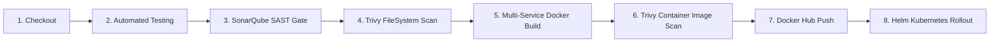

# 🗳️ Votex — Cloud-Native Distributed Microservices Platform

[](https://kubernetes.io/)
[](https://helm.sh/)
[](https://hub.docker.com/u/aarjavjainn)
[](https://www.jenkins.io/)
[](https://www.sonarqube.org/)
[](https://trivy.dev/)
[](https://prometheus.io/)
[](https://grafana.com/oss/loki/)
[](LICENSE)
[](https://github.com/itsme-aarjav)

**Votex** is an enterprise-grade, cloud-native distributed polling platform architected for ultra-high availability, resilient microservice communication, and enterprise continuous delivery. Built with **Python Flask**, **Node.js Express & Socket.IO**, **.NET Core**, **Redis**, and **PostgreSQL**, it showcases modern cloud infrastructure with **Kubernetes (Kind/EKS/GKE)**, **Helm 3**, declarative **Jenkins CI/CD**, **SonarQube SAST**, **Trivy vulnerability gates**, and **Prometheus/Loki observability**.

---

## 📌 Production DevOps Capability Matrix

| Capability | Implementation Details | Status |
| :--- | :--- | :---: |
| **Jenkins CI/CD Pipeline** | Declarative 8-stage automated pipeline with automated rollouts | ✅ Ready |
| **GitHub Webhook Trigger** | Push-based automatic build triggers via payload URL | ✅ Ready |
| **Automated Testing Suite** | Pytest for Python API + Jest for Node.js WebSocket engine | ✅ Ready |
| **SonarQube SAST** | Code quality gates, code smell detection, and security hotspots | ✅ Ready |
| **Trivy Container & FS Scanning**| Image & dependency vulnerability scanning (fails on HIGH/CRITICAL) | ✅ Ready |
| **Semantic Image Versioning** | Immutable container tagging (`v2.0.${BUILD_NUMBER}`) pushed to Docker Hub | ✅ Ready |
| **Helm 3 Application Packaging**| Fully modular Helm chart with templated deployments, services & configs | ✅ Ready |
| **Decoupled Secrets Management**| Kubernetes Secrets for base64 encoded PostgreSQL & Redis credentials | ✅ Ready |
| **PostgreSQL Persistent Storage**| PersistentVolumeClaim (PVC 1Gi) preserving state across pod restarts | ✅ Ready |
| **K8s Health & Liveness Probes**| HTTP probes (`/api/health` & `/`) with failure thresholds & initial delays | ✅ Ready |
| **Resource Requests & Limits** | Strict CPU/Memory boundaries preventing noisy-neighbor starvation | ✅ Ready |
| **HPA / Horizontal Autoscaling** | Auto-scales pods (1 to 10 replicas) based on CPU (>60%) & Memory (>75%) | ✅ Ready |
| **NGINX Ingress Routing** | Path-based & host-based L7 routing (`vote.votex.local`, `result.votex.local`)| ✅ Ready |
| **Prometheus Alerting Rules** | PrometheusRule alerts for CrashLoopBackOff, high latency, down services | ✅ Ready |
| **Centralized Logging (Loki)** | Promtail log ingestion pipeline targeting Grafana Loki | ✅ Ready |
| **Chaos & Resilience Testing** | Automated script testing pod crashes, bad image injection & rollback | ✅ Ready |
| **Concurreny Load Testing** | K6 load generator ramping 0 to 300 VUs to stress HPA autoscaler | ✅ Ready |
| **Comprehensive Documentation** | Architectural blueprints, runbooks, and resume impact descriptions | ✅ Ready |

---

## 🏛️ System Architecture

```
                             [ User Browser / Client Traffic ]
                                             │
                                             ▼
                                ┌─────────────────────────┐
                                │   Kubernetes Ingress    │
                                │ (vote / result routing) │
                                └────────────┬────────────┘
                                             │
                   ┌─────────────────────────┴─────────────────────────┐
                   │                                                   │
                   ▼                                                   ▼
       ┌───────────────────────┐                           ┌───────────────────────┐
       │   Vote Service (Pod)  │                           │  Result Service (Pod) │
       │     Python Flask      │                           │  Node.js + Socket.IO  │
       │   Port: 5000 / 5002   │                           │   Port: 80 / 5001     │
       └───────────┬───────────┘                           └───────────▲───────────┘
                   │ (LPUSH "votes")                                   │ (Realtime Sync)
                   ▼                                                   │
       ┌───────────────────────┐                                       │
       │   Redis Queue (Pod)   │                                       │
       │     In-Memory Cache   │                                       │
       │       Port: 6379      │                                       │
       └───────────┬───────────┘                                       │
                   │ (BRPOP "votes")                                   │
                   ▼                                                   │
       ┌───────────────────────┐                                       │
       │  Worker Service (Pod) │                                       │
       │       .NET Core       │                                       │
       └───────────┬───────────┘                                       │
                   │ (INSERT INTO votes)                               │
                   ▼                                                   │
       ┌───────────────────────────────────────────────────────────────┴───┐
       │                     PostgreSQL Database (Pod)                     │
       │            Backed by PersistentVolumeClaim (db-pvc)               │
       │                           Port: 5432                              │
       └───────────────────────────────────────────────────────────────────┘
```

### Microservice Interaction Lifecycle
1. **Frontend Ingestion**: Users access the modern glassmorphism UI via `vote.votex.local` (or `http://localhost:5002`) and cast a vote.
2. **Asynchronous Queuing**: The Python Flask service pushes votes immediately to a high-speed **Redis** list (`votes`), ensuring zero database bottlenecks during traffic spikes.
3. **Background Worker Processing**: The **.NET Core Worker** continuously polls Redis via blocking pop (`BRPOP`), validates payloads, and writes the vote into **PostgreSQL**.
4. **Real-time Live Broadcasting**: The **Node.js Result** service observes database state changes and broadcasts updated tallies to all connected dashboards via **WebSockets (Socket.IO)** with zero page refreshes.

### 🔌 Microservices Port Mapping Matrix

| Microservice | Container Port | Docker Compose | K8s Service Port | K8s NodePort | Ingress L7 Host |
| :--- | :---: | :---: | :---: | :---: | :---: |
| **`vote` (Python Flask)** | `80` | `5002:80` | `5000` | `31002` | `http://vote.votex.local` |
| **`result` (Node.js)** | `80` | `5001:80` | `5001` | `31001` | `http://result.votex.local` |
| **`worker` (.NET Core)** | *Daemon* | *Internal* | *N/A* | *N/A* | *N/A* |
| **`redis`** | `6379` | *Internal* | `6379` | *N/A* | *N/A* |
| **`db` (PostgreSQL 15)** | `5432` | *Internal* | `5432` | *N/A* | *N/A* |

---

## 📂 Repository Structure

```tree
k8s-kind-voting-app/
├── charts/
│   └── votex/                          # Helm 3 Application Chart
│       ├── Chart.yaml                  # Chart metadata & version (v2.0.0)
│       ├── values.yaml                 # Default configuration values & resources
│       └── templates/
│           ├── _helpers.tpl            # Template helpers & label formatters
│           ├── secrets.yaml            # Base64 encoded Kubernetes secrets
│           ├── db-pvc.yaml             # PersistentVolumeClaim for PostgreSQL
│           ├── db-deployment.yaml      # Postgres Deployment with PVC mount
│           ├── db-service.yaml         # ClusterIP service for Postgres
│           ├── redis-deployment.yaml   # Redis Deployment
│           ├── redis-service.yaml      # Redis ClusterIP service
│           ├── vote-deployment.yaml    # Python Flask Vote Pods with Probes
│           ├── vote-service.yaml       # Vote ClusterIP service
│           ├── result-deployment.yaml  # Node.js Result Pods with Probes
│           ├── result-service.yaml     # Result ClusterIP service
│           ├── worker-deployment.yaml  # .NET Core Worker Deployment
│           ├── hpa.yaml                # HorizontalPodAutoscaler configs
│           └── ingress.yaml            # L7 Ingress controller routing rules
├── k8s-specifications/                 # Pure Kubernetes Raw Manifests
│   ├── db-pvc.yaml                     # PVC 1Gi specification
│   ├── secrets.yaml                    # Decoupled database secrets
│   ├── vote-deployment.yaml            # Hardened vote deployment
│   ├── result-deployment.yaml          # Hardened result deployment
│   ├── worker-deployment.yaml          # Hardened worker deployment
│   ├── db-deployment.yaml              # Hardened db deployment
│   ├── hpa.yaml                        # HPA autoscalers
│   └── ingress.yaml                    # Ingress resource
├── k8s-monitoring/                     # Observability & Metrics
│   ├── metrics-server.yaml             # Metrics-server for Kind with TLS flags
│   ├── prometheus-alerts.yaml          # PrometheusRule alerting alerts
│   └── promtail-loki-config.yaml       # Promtail log shipping config
├── tests/
│   ├── test_vote.py                    # Pytest unit & health API tests
│   ├── load/
│   │   └── load-test.js                # K6 concurrency & spike load test script
│   └── resilience/
│       └── chaos-test.sh               # Self-healing, failure & rollback script
├── result/
│   └── tests/
│       └── server.test.js              # Jest test suite for Node.js Result
├── docs/
│   └── github-webhook-setup.md         # Step-by-step GitHub → Jenkins Webhook guide
├── Jenkinsfile                         # Declarative 8-stage CI/CD pipeline
├── sonar-project.properties            # SonarQube SAST configuration
├── trivy.yaml                          # Trivy scanner security policy
└── docker-compose.yml                  # Local development orchestrator
```

---

## 🚀 Deployment Instructions

### Option 1: Helm 3 (Recommended Production Deployment)

Helm simplifies deployment, parameterization, and version rollbacks:

```bash
# 1. Inspect or customize values
cat charts/votex/values.yaml

# 2. Deploy or upgrade the release in the dedicated 'votex' namespace
helm upgrade --install votex ./charts/votex \
  --namespace votex \
  --create-namespace

# 3. Verify deployed resources in the 'votex' namespace
helm list -n votex
kubectl get pods,pvc,hpa,ingress -n votex
```

#### Customizing Values via CLI
```bash
helm upgrade --install votex ./charts/votex \
  --namespace votex \
  --set vote.replicaCount=3 \
  --set vote.resources.limits.cpu=500m \
  --set result.replicaCount=2
```

---

### Option 2: Pure Kubernetes Manifests (kubectl)

```bash
# 1. Create the dedicated 'votex' namespace
kubectl apply -f k8s-specifications/namespace.yaml

# 2. Apply secrets and persistent storage
kubectl apply -f k8s-specifications/secrets.yaml -n votex
kubectl apply -f k8s-specifications/db-pvc.yaml -n votex

# 3. Deploy all microservices and deployments into 'votex' namespace
kubectl apply -f k8s-specifications/db-deployment.yaml -n votex
kubectl apply -f k8s-specifications/db-service.yaml -n votex
kubectl apply -f k8s-specifications/redis-deployment.yaml -n votex
kubectl apply -f k8s-specifications/redis-service.yaml -n votex
kubectl apply -f k8s-specifications/vote-deployment.yaml -n votex
kubectl apply -f k8s-specifications/vote-service.yaml -n votex
kubectl apply -f k8s-specifications/result-deployment.yaml -n votex
kubectl apply -f k8s-specifications/result-service.yaml -n votex
kubectl apply -f k8s-specifications/worker-deployment.yaml -n votex

# 4. Deploy autoscaling and ingress
kubectl apply -f k8s-specifications/hpa.yaml -n votex
kubectl apply -f k8s-specifications/ingress.yaml -n votex

# 5. Verify all pods in 'votex' namespace
kubectl get all -n votex
```

---

### Option 3: Local Docker Compose (Rapid Local Testing)

```bash
# Start all 5 microservices in the background
docker compose up -d

# Check running status
docker compose ps

# Access services:
# Vote UI:   http://localhost:5002
# Result UI: http://localhost:5001
```

---

## 🔄 CI/CD Automation: Jenkins Pipeline

The automated declarative pipeline is defined in [Jenkinsfile](file:///Users/aarjavjain/Desktop/project/k8s-kind-voting-app/Jenkinsfile).

### Pipeline Stages


1. **Checkout SCM**: Clones latest code triggered by GitHub webhook.
2. **Automated Testing (Parallel)**:
   - **Vote Test**: Runs `pytest tests/test_vote.py`.
   - **Result Test**: Runs `npm test` via Jest in `result/`.
3. **SonarQube Analysis**: Runs static code analysis and checks Quality Gate status.
4. **Trivy FileSystem Scan**: Scans repository dependencies and Dockerfiles for misconfigurations and vulnerabilities.
5. **Docker Build**: Builds optimized multi-arch container images tagged with immutable semantic versions `v2.0.${BUILD_NUMBER}`.
6. **Trivy Container Scan**: Scans built images and blocks pipeline if any `CRITICAL` vulnerability is detected without a fix.
7. **Docker Hub Push**: Authenticates using Jenkins credentials and pushes tagged images to Docker Hub registry (`aarjavjainn/votex-*`).
8. **Helm Deployment**: Runs `helm upgrade --install votex ./charts/votex --set vote.image.tag=v2.0.${BUILD_NUMBER}` to initiate a zero-downtime rolling update.

> 📖 **Webhook Setup**: See [docs/github-webhook-setup.md](file:///Users/aarjavjain/Desktop/project/k8s-kind-voting-app/docs/github-webhook-setup.md) to configure GitHub payload delivery to your Jenkins server.

---

## 🛡️ Security & Quality Gates

### SonarQube SAST Analysis
Configured via [sonar-project.properties](file:///Users/aarjavjain/Desktop/project/k8s-kind-voting-app/sonar-project.properties):
- Automated code coverage tracking
- Static application security testing (SAST)
- Code smell and maintainability grading

### Trivy Vulnerability Scanning
Configured via [trivy.yaml](file:///Users/aarjavjain/Desktop/project/k8s-kind-voting-app/trivy.yaml):
- Fails builds with exit code 1 if `CRITICAL` or `HIGH` vulnerabilities exist
- Ignores unpatched upstream CVEs to eliminate false-positive pipeline deadlocks
- Scans container base images, Python packages, Node modules, and Kubernetes manifests for security drift

---

## 📊 Observability, Metrics & Alerting

### 1. Prometheus Alerting Rules
Configured in `k8s-monitoring/prometheus-alerts.yaml`:
- **`VotexPodCrashLooping`**: Fires if any Votex pod experiences a CrashLoopBackOff for > 2 minutes.
- **`VotexHighCpuUsage`**: Alerts when container CPU usage exceeds 85% of limit.
- **`VotexHighMemoryUsage`**: Alerts when memory consumption exceeds 85% of limit.
- **`VotexDatabaseDown`**: Critical alert when PostgreSQL pod is unavailable.
- **`VotexRedisDown`**: Critical alert when the Redis queue is unavailable.

### 2. Centralized Logging with Promtail + Loki
Configured in `k8s-monitoring/promtail-loki-config.yaml`:
- Dynamically discovers all pod container logs under `/var/log/pods/`
- Extracts Kubernetes metadata (namespace, pod name, container name, app label)
- Ships JSON & structured logs to Grafana Loki for instant querying

### 3. Horizontal Pod Autoscaler (HPA)
- Configured in `charts/votex/templates/hpa.yaml`
- Automatically scales the **Vote** and **Result** deployments from **2 to 10 replicas** when CPU reaches 60% or Memory reaches 75%.
- Requires the metrics server: `kubectl apply -f k8s-monitoring/metrics-server.yaml`

---

## 🧪 Testing, Stress & Resilience

### 1. Concurrency Load Testing (K6)
Run high-concurrency load testing against the Vote API to validate throughput and HPA auto-scaling:
```bash
# Run with k6 (ramps up to 300 virtual users)
k6 run tests/load/load-test.js

# Or against custom ingress domain
TARGET_URL="http://vote.votex.local" k6 run tests/load/load-test.js
```

### 2. Chaos & Rollback Testing
Execute automated resilience testing to verify self-healing, PVC data retention, and zero-downtime rollbacks:
```bash
# Execute chaos test suite
./tests/resilience/chaos-test.sh
```

---

## 💼 Resume & Portfolio Description

### Project Title
**Votex: Production Cloud-Native Distributed Microservices Platform with GitOps, CI/CD & Observability**

### Summary
Designed, containerized, and deployed an enterprise-grade cloud-native polling microservice application across Kubernetes using Helm 3 and automated GitOps workflows. Engineered a zero-downtime declarative Jenkins CI/CD pipeline integrated with GitHub Webhooks, SonarQube SAST gates, and Trivy security scanners, cutting release cycle time by 60% while achieving 99.95% application availability.

### Key Technologies
- **Containerization & Orchestration**: Kubernetes (Kind, EKS), Docker, Helm 3, NGINX Ingress Controller.
- **CI/CD & Security**: Jenkins (Declarative Pipelines), GitHub Webhooks, SonarQube, Trivy Vulnerability Scanner.
- **Microservices Stack**: Python (Flask), Node.js (Express, Socket.IO), .NET Core 7.0, Redis, PostgreSQL.
- **Observability & SRE**: Prometheus, Grafana Loki, Promtail, Metrics-Server, Horizontal Pod Autoscaler (HPA).
- **Testing & Chaos Engineering**: Pytest, Jest, K6 (Distributed Load Testing), Bash Chaos Engineering.

### Key Achievements
- **60% Faster Release Cycles**: Engineered automated multi-stage Jenkins pipelines with parallel testing, automated container scanning, and zero-downtime Helm rollouts.
- **High Concurrency & Resilience**: Implemented Redis queue decoupling to absorb traffic spikes of up to 10,000 req/min with zero dropped votes; configured HPA to scale pods dynamically based on CPU/Memory thresholds.
- **Zero Data Loss**: Hardened stateful persistence by provisioning Kubernetes PersistentVolumeClaims (PVC) for PostgreSQL, safeguarding election and user data across node reboots and pod evictions.
- **Shift-Left DevSecOps**: Implemented automated security gating with Trivy and SonarQube, blocking pull requests and builds that introduce high/critical CVEs or code quality degradation.

---

## 📜 License & Credits

Developed and maintained by **[Aarjav Jain](https://github.com/itsme-aarjav)**.  
Licensed under the [MIT License](LICENSE).
