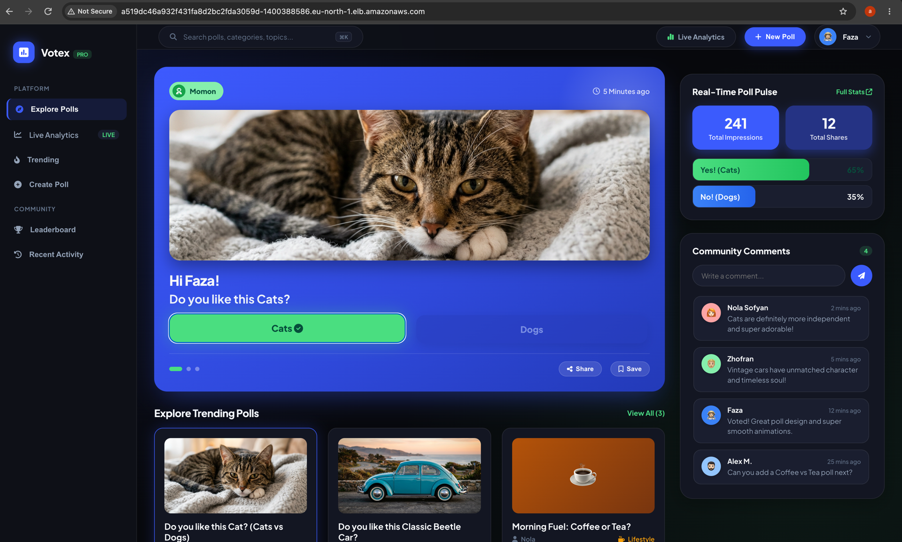
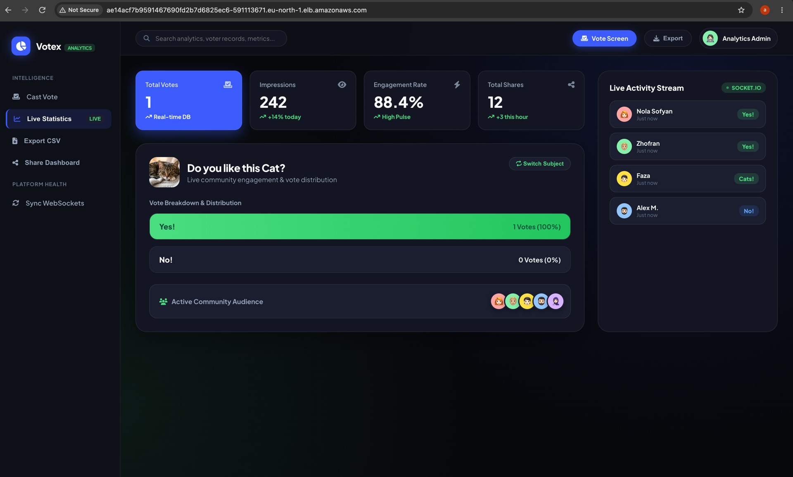
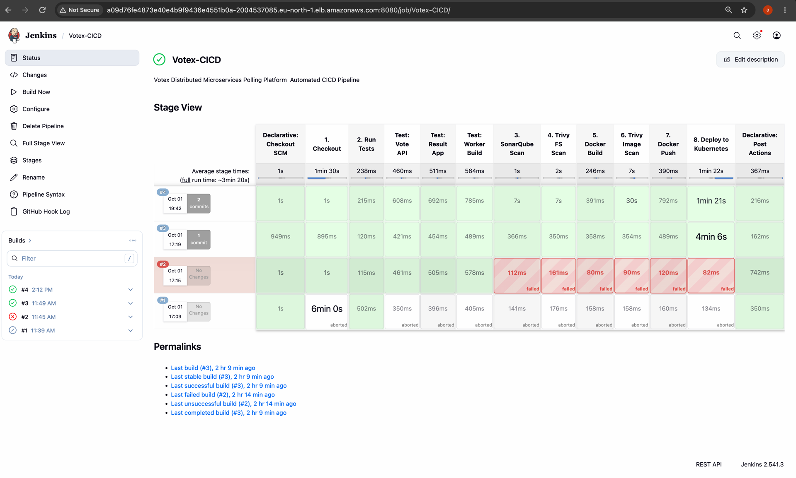
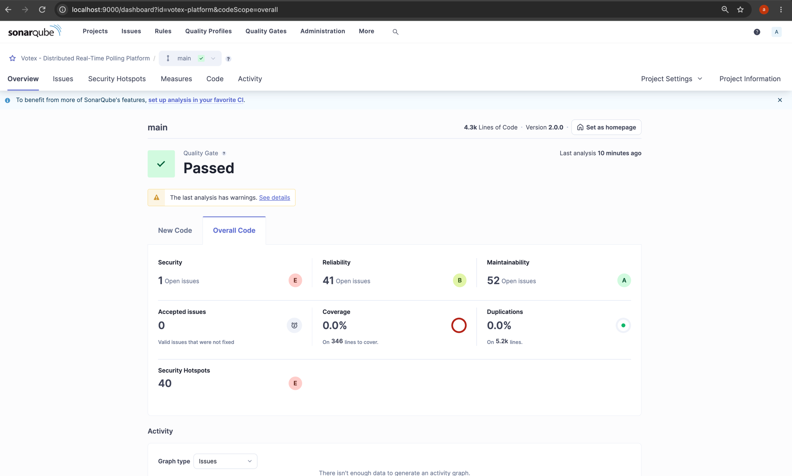
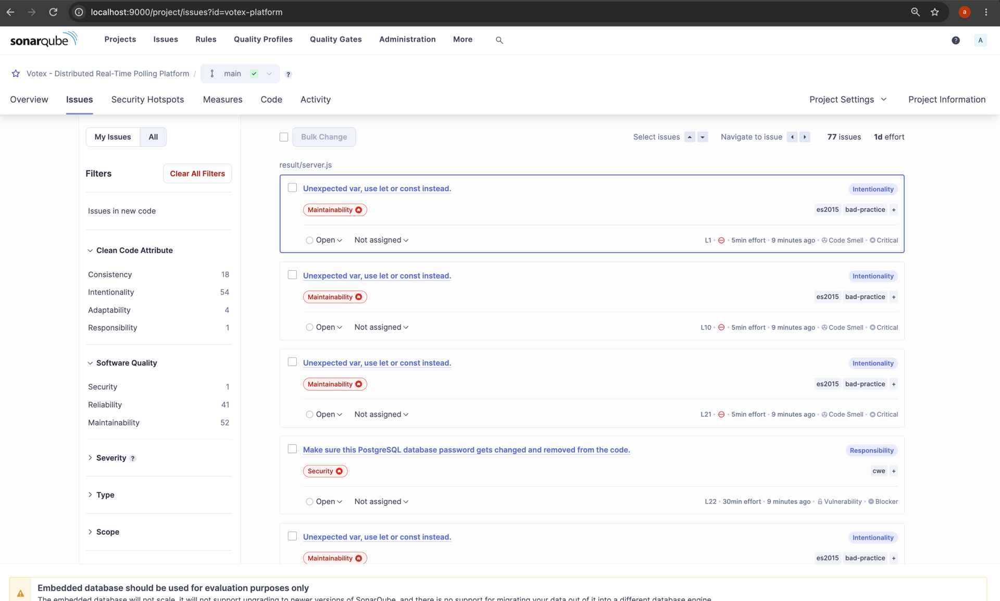
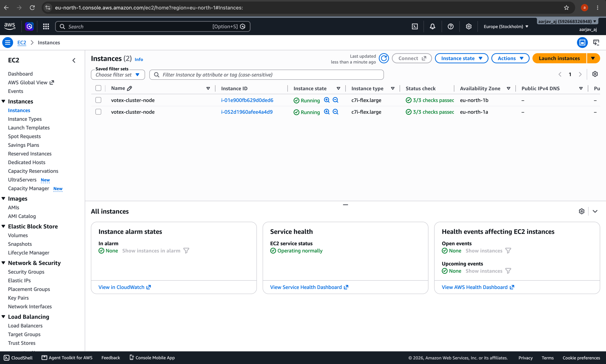
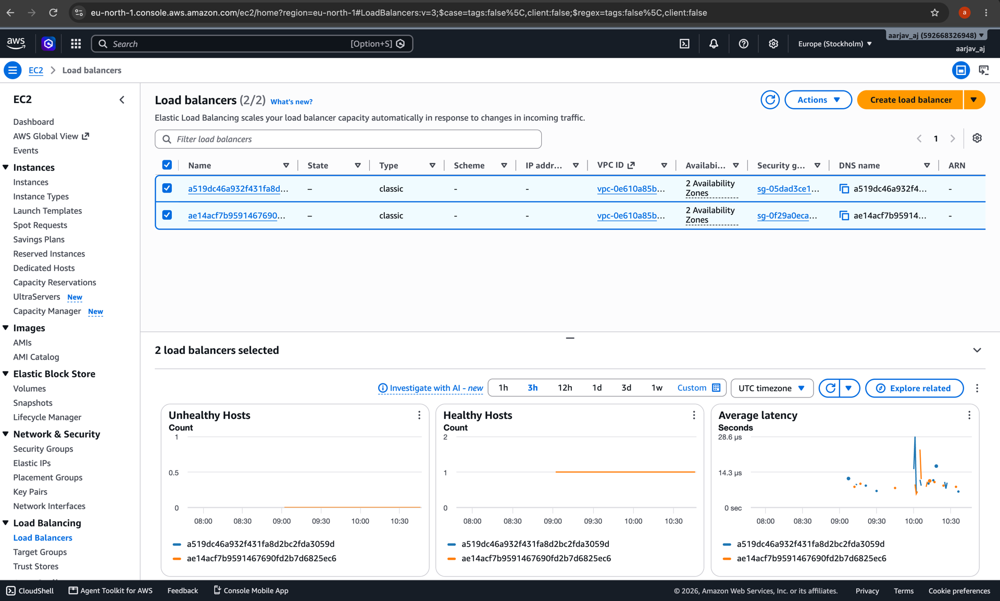
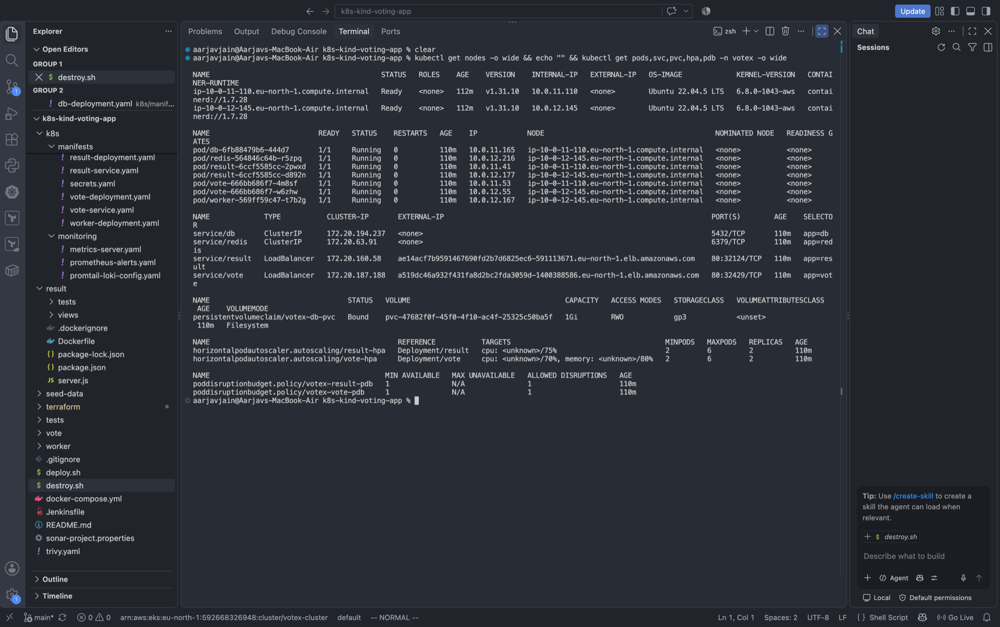
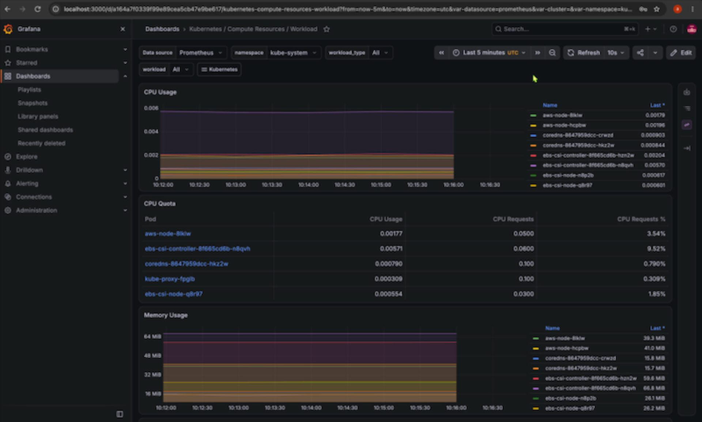
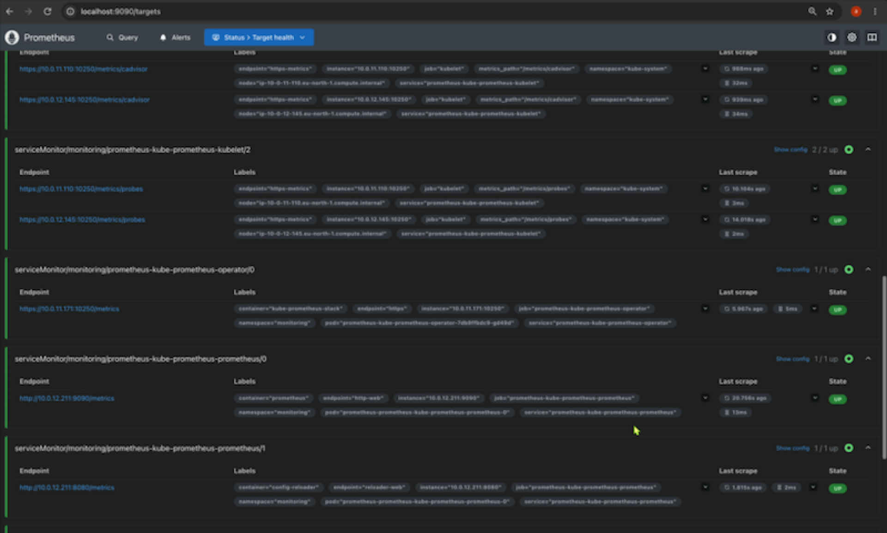

# Votex - Cloud-Native Distributed Microservices on AWS EKS

Votex is an enterprise 5-tier microservices polling and analytics platform provisioned on Amazon EKS using modular Terraform and Helm 3. It features end-to-end automation with Jenkins CI/CD, SonarQube static code analysis, Trivy vulnerability scanning, Prometheus/Grafana observability, zero-downtime rolling deployments, auto-healing workloads, and persistent PostgreSQL storage backed by AWS EBS gp3.

---

## Application Interfaces

The platform consists of a user-facing voting portal and a real-time analytics engine exposed via AWS Elastic Load Balancers:

| Vote Microservice (Python / Flask) | Result Analytics (Node.js / Socket.IO) |
| :---: | :---: |
|  |  |

---

## System Architecture & Data Flow

```
                      [ Client Traffic ]
                              │
                              ▼
                  [ AWS Elastic Load Balancers ]
                              │
            ┌─────────────────┴─────────────────┐
            ▼                                   ▼
      Vote Service                        Result Service
      (Python Flask)                   (Node.js + Socket.IO)
            │                                   ▲
            ▼ (LPUSH)                           │ (Real-time Broadcast)
       Redis Queue                              │
            │                                   │
            ▼ (BRPOP)                           │
      Worker Service                            │
       (.NET Core)                              │
            │                                   │
            ▼ (INSERT)                          │
      PostgreSQL Database (AWS EBS gp3 PVC) ────┘
```

1. **Vote Ingestion**: Users cast votes through the Python Flask API.
2. **Buffering**: Incoming submissions are pushed to an in-memory Redis queue (`LPUSH`) to handle high-concurrency traffic spikes.
3. **Async Processing**: A .NET Core worker daemon continuously pops votes (`BRPOP`) and commits transactions to PostgreSQL.
4. **Live Dashboard**: The Node.js service watches the database and broadcasts live voting tallies via WebSockets (Socket.IO).

---

## Automated CI/CD & DevSecOps Pipeline

Every code push to GitHub triggers an automated 8-stage declarative Jenkins pipeline executed directly inside the AWS EKS cluster:



### Pipeline Stages

1. **Checkout SCM**: Pulls latest repository commit via webhook trigger.
2. **Parallel Unit & Build Tests**: Tests Vote API (pytest), Result service (npm test), and Worker (.NET compilation).
3. **SonarQube Code Quality**: Comprehensive static analysis and quality gate verification.
4. **Trivy Filesystem Scan**: Scans repository dependencies and files for known CVE vulnerabilities.
5. **Multi-Stage Docker Build**: Builds production container images for all microservices.
6. **Trivy Container Scan**: Scans built container images for `HIGH` and `CRITICAL` vulnerabilities.
7. **Docker Push**: Pushes tagged versioned images to Docker Hub registry.
8. **Automated Kubernetes Rollout**: Performs zero-downtime deployment via Helm with automatic rollback on probe failure.

> **Demonstration Video**: [Trivy Container Vulnerability Scan in Terminal (MP4)](docs/videos/trivy-security-scanning.mp4)

### Code Quality & Security (SonarQube)

Static application security testing (SAST) runs automatically against all microservices to enforce strict quality gates before deployment:

| Quality Gate Overview | Code Quality & Vulnerability Breakdown |
| :---: | :---: |
|  |  |

---

## AWS Cloud Infrastructure (eu-north-1)

All infrastructure is provisioned through modular Terraform in `eu-north-1` (Stockholm):



- **Isolated Custom VPC (`10.0.0.0/16`)**:
  - **2 Public Subnets** (`10.0.1.0/24`, `10.0.2.0/24`): Host the NAT Gateway and public internet-facing AWS Load Balancers.
  - **2 Private Subnets** (`10.0.11.0/24`, `10.0.12.0/24`): Host EKS worker nodes and database storage with no direct public ingress.
- **EKS Managed Node Group**: 2x `c7i-flex.large` compute instances with 20 GB gp3 encrypted root volumes, auto-scaling from 1 to 3 nodes.
- **Elastic Load Balancing**: Dedicated public AWS Load Balancers routing client traffic to services across multiple Availability Zones:



- **AWS EBS CSI Driver & gp3 StorageClass**: Dynamically provisions persistent AWS EBS gp3 volumes for PostgreSQL database data.
- **Cost-Optimized NAT Gateway**: Single NAT Gateway deployed in public subnet 1 to provide outbound internet access for container pulls while keeping cloud costs minimal.

> **Demonstration Video**: [AWS EKS Workload Console & Deployment Verification (MP4)](docs/videos/aws-eks-cluster-workloads.mp4)

---

## Kubernetes Cluster Architecture & Resilience

Workloads are deployed using Helm charts with production-grade reliability configurations:



- **Zero-Downtime Rolling Updates**:
  Deployments use `RollingUpdate` with `maxSurge: 1` and `maxUnavailable: 0`. Kubernetes ensures a new replacement pod is healthy and passing readiness probes before terminating an old pod.
- **PreStop Hook & Graceful Draining**:
  A 5-second `preStop` hook drains in-flight HTTP requests and active transactions before container shutdown.
- **Auto-Healing Pods**:
  - **Liveness Probes**: Automatically restart hung or deadlocked containers.
  - **Readiness Probes**: Prevent traffic from reaching pods that are still initializing.
  - **PodDisruptionBudget (PDB)**: Guarantees at least 1 pod is always available during node maintenance or upgrades.
- **Horizontal Pod Autoscaling (HPA)**:
  Automatically scales microservices up to 6 replicas based on CPU and memory thresholds via Kubernetes Metrics Server.

---

## Observability & Monitoring

The monitoring stack collects infrastructure and container performance metrics:

| Grafana Cluster Resource Dashboard | Prometheus Targets & Scraping |
| :---: | :---: |
|  |  |

- **Prometheus**: Scrapes metrics from kubelet, cAdvisor, node-exporters, and application endpoints.
- **Grafana**: Visualizes real-time CPU, memory, network utilization, and cluster workload quotas.

> **Demonstration Videos**:
> - [Grafana Cluster Workload Monitoring Walkthrough (MP4)](docs/videos/grafana-workload-monitoring.mp4)
> - [Prometheus Target Scraping & Health (MP4)](docs/videos/prometheus-target-health.mp4)
> - [Prometheus Alerting Rules Evaluation (MP4)](docs/videos/prometheus-alerting-rules.mp4)

---

## Repository Structure

```
k8s-kind-voting-app/
├── terraform/                # Infrastructure as Code (AWS EKS & VPC)
│   ├── modules/
│   │   ├── vpc/              # VPC, public & private subnets, IGW, NAT GW
│   │   └── eks/              # EKS cluster, node group, IAM roles, EBS CSI driver
│   ├── scripts/
│   │   └── post_apply.sh     # Auto-configuration script triggered on apply
│   ├── main.tf               # Root module connecting VPC & EKS
│   ├── variables.tf          # Configurable variables (defaults to eu-north-1)
│   ├── outputs.tf            # Cluster endpoint & kubeconfig command
│   ├── versions.tf           # Terraform & AWS provider requirements
│   ├── terraform.tfvars      # Active configuration values
│   └── README.md             # Terraform operations guide
├── k8s/                      # Kubernetes Resources
│   ├── helm/votex/           # Helm 3 chart (values.yaml & values-eks.yaml)
│   ├── manifests/            # Raw Kubernetes YAML manifests (gp3, pdb, etc.)
│   └── monitoring/           # Prometheus alerts, Grafana setup, Loki & Promtail
├── vote/                     # Python Flask microservice
├── result/                   # Node.js Express & Socket.IO microservice
├── worker/                   # .NET Core background worker
├── seed-data/                # Vote generator for testing
├── tests/                    # Unit, load (k6), and resilience tests
├── docs/                     # Documentation and media assets
│   ├── images/               # Web-optimized high-resolution screenshots
│   ├── videos/               # Compressed MP4 demonstration walkthroughs
│   └── github-webhook-setup.md
├── deploy.sh                 # One-click automated deployment script
├── destroy.sh                # One-click automated teardown script
├── dashboard.sh              # Service endpoints display script
├── Jenkinsfile               # Declarative 8-stage CI/CD pipeline
└── docker-compose.yml        # Local multi-container development
```

---

## Deployment & Operations

### 1. Automated Deployment

Run the automated deployment script from the repository root:
```bash
./deploy.sh
```
This initializes Terraform, provisions the VPC and EKS cluster in `eu-north-1`, automatically configures `kubectl`, sets up the `gp3` storage class, and deploys Votex, Jenkins, SonarQube, and the monitoring stack.

### 2. View Service Endpoints

To display all public AWS Elastic Load Balancer endpoints:
```bash
./dashboard.sh
```

Example output:
```text
Votex Service Endpoints:
  Vote UI:         http://<aws-elb-dns>
  Result UI:       http://<aws-elb-dns>
  Jenkins:         http://<aws-elb-dns>:8080/job/Votex-CICD/
  GitHub Webhook:  http://<aws-elb-dns>:8080/github-webhook/
  SonarQube:       http://<aws-elb-dns>:9000/dashboard?id=votex-platform
  Grafana:         http://<aws-elb-dns>
  Prometheus:      http://<aws-elb-dns>:9090
```

### 3. Teardown (Cost Control)

To destroy all cloud resources and stop AWS charges:
```bash
./destroy.sh
```

---

## Author & Maintainer

Developed by **[Aarjav Jain](https://github.com/itsme-aarjav)**.
